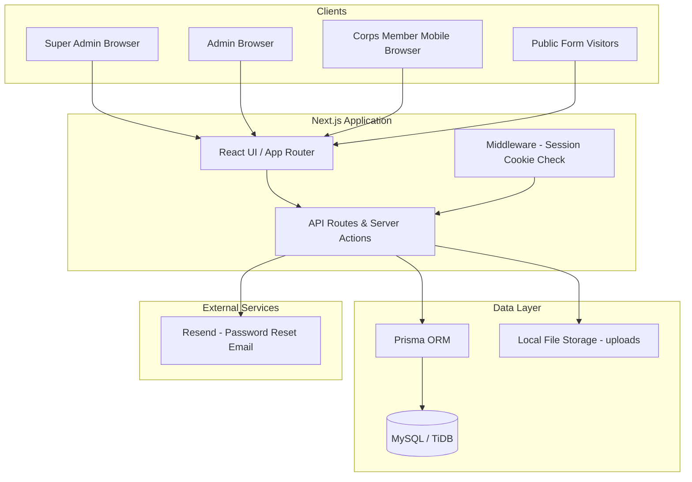
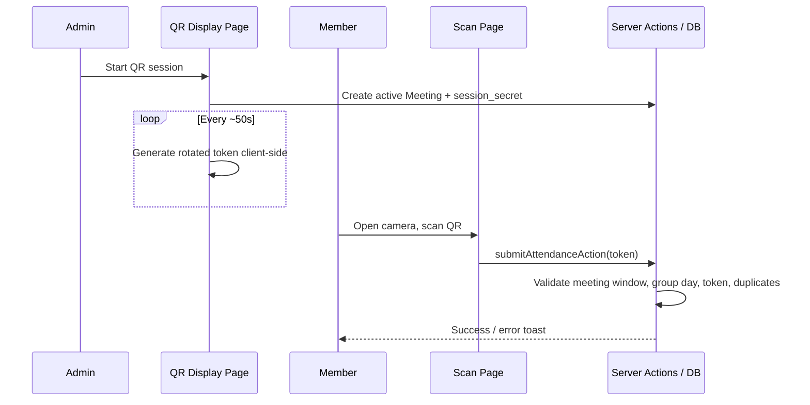

# CDS Attendance System — Implementation Report

**Organization:** NYSC CDS Attendance · Akure South LGA  
**Document version:** 1.0  
**Date:** _[Fill in deployment / handover date]_  
**Prepared by:** _[Name / team]_  
**Status:** Draft / Final _(circle one)_

---

## Table of Contents

1. [Executive Summary](#1-executive-summary)
2. [Project Overview](#2-project-overview)
3. [System Architecture](#3-system-architecture)
4. [Technology Stack](#4-technology-stack)
5. [Data Model](#5-data-model)
6. [Implemented Features](#6-implemented-features)
7. [User Roles & Access Control](#7-user-roles--access-control)
8. [User Guide by Role](#8-user-guide-by-role)
9. [Public & External User Flows](#9-public--external-user-flows)
10. [Deployment & Operations](#10-deployment--operations)
11. [Security & Compliance](#11-security--compliance)
12. [Known Limitations](#12-known-limitations)
13. [Appendices](#13-appendices)

---

## 1. Executive Summary

The **CDS Attendance System** is a web application for managing National Youth Service Corps (NYSC) Community Development Service (CDS) attendance at **Akure South LGA**. It replaces a prior Convex-based stack with a **Next.js 15** frontend and **MySQL** (TiDB-compatible) backend via **Prisma**.

The system supports:

- **QR-based attendance** with rotating tokens during CDS meetings
- **Role-based administration** (Super Admin, Admin, Corps Member)
- **Monthly clearance** reports and verifiable PDF exports
- **Documentation desks** for corps members, employers, rejected/reposting members, and employer requests
- **User lifecycle management** including signup, blocking, device binding, and password reset

_[Optional: Add 2–3 sentences on deployment status, number of users/groups onboarded, and go-live date.]_

---

## 2. Project Overview

### 2.1 Purpose

| Goal | Description |
|------|-------------|
| Accurate attendance | Record who attended each CDS meeting using time-limited QR codes |
| Accountability | Prevent duplicate scans; enforce meeting-day and time-window rules |
| Administration | Manage CDS groups, assign admins, generate reports |
| Documentation | Collect structured data from corps members and employers via shareable links |
| Clearance | Let corps members prove monthly attendance; allow third-party verification via token |

### 2.2 Scope (In Scope)

- User authentication and session management
- CDS group CRUD (Super Admin)
- QR session start/stop and corps member scanning
- Live attendance monitoring (Admin)
- Monthly reports and exports (CSV/PDF)
- Documentation hub with four desks and public registration forms
- System settings (batch attendance requirements)
- Device binding for corps members
- Manual attendance marking (Super Admin)
- Password reset via email

### 2.3 Out of Scope _(confirm with stakeholders)_

- Mobile native apps (web-only; responsive UI)
- Payment / stipend processing
- Integration with national NYSC central systems
- Multi-LGA tenancy _(currently branded for Akure South LGA)_

---

## 3. System Architecture

### 3.1 High-Level Diagram



### 3.2 Request Flow (Attendance Scan)



### 3.3 Application Structure

| Layer | Location | Responsibility |
|-------|----------|----------------|
| Pages (UI) | `app/` | Routes, layouts, role-specific screens |
| Server actions | `app/actions/` | Mutations: auth, users, QR, attendance, reports, documentation |
| API routes | `app/api/` | REST endpoints for dashboards, QR, exports, cron |
| Repositories | `lib/repositories/` | Database access and business rules |
| Shared libs | `lib/` | Validation, QR tokens, caching, storage, utils |
| Schema | `prisma/schema.prisma` | MySQL models and indexes |
| Components | `components/` | UI shell, tables, charts, documentation export bar |

---

## 4. Technology Stack

| Component | Technology | Version / Notes |
|-----------|------------|-----------------|
| Framework | Next.js (App Router) | 15.5.x |
| UI | React, Tailwind CSS | React 19 |
| ORM | Prisma | 6.19.x |
| Database | MySQL / TiDB Serverless | `relationMode = "prisma"` for TiDB |
| Auth | Custom sessions (cookie `session_token`) | bcrypt password hashing |
| QR scanning | jsQR | Client-side camera |
| QR generation | qrcode (admin display), HMAC rotation | Server validates token |
| Data fetching | TanStack React Query | Dashboard & lists |
| Email | Resend + React Email templates | Password reset |
| Exports | ExcelJS | Documentation batch export |
| Lint / format | Biome | `npm run lint` |

### 4.1 Environment Variables

| Variable | Required | Purpose |
|----------|----------|---------|
| `DATABASE_URL` | Yes | MySQL connection string |
| `FILE_STORAGE_PATH` | Yes | Local path for uploaded medical files (default `./uploads`) |
| `CRON_SECRET` | Optional | Protects `/api/cron/*` cleanup endpoints |
| `RESEND_API_KEY` | For email | Password reset delivery _(verify in `.env.local`)_ |

See `.env.example` for the canonical template.

### 4.2 Run Commands

```bash
# Install dependencies
npm install

# Generate Prisma client & apply schema
npx prisma generate
npx prisma db push   # or migrate deploy in production

# Development
npm run dev

# Production build
npm run build
npm start
```

---

## 5. Data Model

### 5.1 Core Entities

| Model | Purpose |
|-------|---------|
| `User` | All accounts; roles: `super_admin`, `admin`, `corps_member` |
| `CdsGroup` | CDS group name, meeting schedule, venue, assigned admin IDs |
| `AdminGroupAssignment` | Links admins to groups they manage |
| `Meeting` | Active QR session for a meeting date (session secret, rotation interval) |
| `QrToken` | Historical/consumed token records tied to meetings |
| `Attendance` | Per-user per-day record (`present` / `absent`) |
| `Session` | Login sessions with optional device fingerprint |
| `Setting` | Key-value config (e.g. batch attendance requirements) |
| `DocumentationLink` | Shareable tokens for public forms |
| `CorpMemberDoc`, `EmployerDoc`, `RejectedRepostingDoc`, `CorpMemberRequest` | Submitted documentation records |
| `ClearanceVerification` | Public verification tokens for monthly clearance |
| `AuditLog` | Admin action audit trail |
| `PasswordResetToken` | Time-limited reset tokens |

### 5.2 User Roles (Schema)

```text
super_admin  → Full system control
admin        → QR sessions, live monitor, documentation desks
corps_member → Scan attendance, history, clearance
```

---

## 6. Implemented Features

### 6.1 Authentication & Account Management

| Feature | Description | Roles |
|---------|-------------|-------|
| Login | State code + password; session cookie | All |
| Signup | Self-registration with CDS group selection | Corps member (public `/signup`) |
| Logout | Clears session | All |
| Forgot / reset password | Email link via Resend | All |
| Forced password change | `/password-change` when required | As enforced |
| Device binding | First login locks corps member to device fingerprint; mismatch blocks account | Corps member |
| Block / unblock users | Super Admin manages blocked corps members and admins | Super Admin |

### 6.2 CDS Groups & Admin Assignments

| Feature | Route | Roles |
|---------|-------|-------|
| List / create / edit / delete groups | `/groups`, `/groups/create`, `/groups/[id]/edit` | Super Admin |
| Assign admins to groups | `/admin-assignments` | Super Admin |
| Meeting schedule | Days, time (24h), duration, venue per group | Super Admin |

### 6.3 Attendance (QR)

| Feature | Description | Roles |
|---------|-------------|-------|
| Start QR session | Creates active `Meeting` with rotating token secret | Admin, Super Admin |
| QR display | Live QR code on `/qr`; auto-rotation (~50s default) | Admin |
| Stop session | Deactivates meeting | Admin |
| Scan attendance | Camera scan on `/scan`; validates token, day, time window | Corps member |
| Duplicate prevention | One attendance record per user per calendar day (Nigeria TZ) | System |
| Meeting window | Scan allowed only on group's meeting day ± buffer around scheduled time | System |
| Live monitor | Real-time view of today's attendance | Admin |
| Manual mark / unmark | Super Admin can mark present without scan | Super Admin |

### 6.4 Dashboard & Analytics

| Feature | Super Admin | Admin | Corps Member |
|---------|-------------|-------|--------------|
| Key metrics (users, groups, attendance) | ✓ | Partial | Personal stats |
| Charts (attendance by role, top groups) | ✓ | — | — |
| Recent activity | ✓ | — | — |
| Quick links to QR / groups | ✓ | ✓ | Scan / history |

### 6.5 Reports & Clearance

| Feature | Route | Roles |
|---------|-------|-------|
| Monthly system report | `/reports` — filter by group, batch, export CSV/PDF | Super Admin |
| Personal attendance history | `/attendance-history` | Corps member |
| Monthly clearance | `/clearance` — view month, export PDF if minimum met | Corps member |
| Public verification | `/verify/clearance/[token]` | Anyone with link |

Batch attendance minimums (default + Batch A/B/C) are configured under **Settings**.

### 6.6 Documentation Hub

Four desks under `/documentation`:

| Desk | Admin route | Public form route |
|------|-------------|-------------------|
| Corps Members | `/documentation/corp-members` | `/documentation/corp-members/[token]` |
| Employers | `/documentation/employers` | `/documentation/employers/[token]` |
| Rejected / Reposting | `/documentation/rejected-reposting` | `/documentation/rejected-reposting/[token]` |
| Corp Member Requests | `/documentation/corp-member-requests` | `/documentation/corp-member-requests/[token]` |

Admins generate **active links**; the public submits forms without logging in. Super Admins can batch-export submissions (Excel).

### 6.7 System Settings

| Setting | Route | Roles |
|---------|-------|-------|
| Default monthly attendance requirement | `/settings` | Super Admin |
| Per-batch overrides (A, B, C from state code) | `/settings` | Super Admin |

### 6.8 User Management

| Feature | Route | Roles |
|---------|-------|-------|
| List / search / filter users | `/users` | Super Admin |
| Create user | `/users/create` | Super Admin |
| Edit user | `/users/[id]/edit` | Super Admin |
| Batch delete | `/users` | Super Admin |
| Blocked users view | `/blocked-users` | Super Admin |

---

## 7. User Roles & Access Control

### 7.1 Role Matrix

| Capability | Super Admin | Admin | Corps Member |
|------------|:-----------:|:-----:|:------------:|
| Dashboard | ✓ | ✓ | ✓ |
| Manage users | ✓ | — | — |
| Blocked users | ✓ | — | — |
| CDS groups CRUD | ✓ | — | — |
| Admin assignments | ✓ | — | — |
| System reports | ✓ | — | — |
| Settings | ✓ | — | — |
| QR session (start/stop/display) | ✓ | ✓ | — |
| Live attendance monitor | ✓ | ✓ | — |
| Documentation hub | ✓ | ✓ | — |
| Scan attendance | — | — | ✓ |
| Attendance history | — | — | ✓ |
| CDS clearance / PDF | — | — | ✓ |
| Self signup | — | — | ✓ (public) |

### 7.2 Navigation by Role

Navigation is defined in `app/(authenticated)/layout.tsx`:

**Super Admin:** Dashboard · Users · Blocked users · Groups · Admin Assignments · Reports · Documentation · Settings  

**Admin:** Dashboard · QR · Live Monitor · Documentation  

**Corps Member:** Dashboard · Scan · Attendance History · CDS Clearance  

### 7.3 Route Guards

Client-side redirects prevent unauthorized access (e.g. corps members cannot open `/qr` or `/reports`). Middleware checks for session cookie presence only; full validation runs server-side via Prisma.

---

## 8. User Guide by Role

### 8.1 Corps Member (CDS Member)

#### First-time setup

1. Open the application URL in a **mobile browser** (Chrome recommended).
2. Go to **Sign up** (`/signup`).
3. Enter full name, email, **state code** (format enforced by system), select your **CDS group**, and set a strong password.
4. After registration, log in with **state code** and password.
5. On first login, the system records your **device fingerprint**. Use the same phone/browser thereafter.

#### Marking attendance (meeting day)

1. Log in → sidebar **Scan**.
2. Tap **Start Camera** and allow camera permission.
3. Point the camera at the admin’s QR code displayed at the meeting.
4. Wait for confirmation toast (“Attendance marked successfully”).
5. You can only scan **once per day** and only during your group’s **meeting window** on scheduled meeting days.

**If scan fails:**

| Message | Action |
|---------|--------|
| Already marked today | No further action needed |
| Not meeting day | Attend only on your group's scheduled days |
| Outside meeting hours | Scan during the meeting time window |
| Invalid / expired QR | Ask admin to refresh QR or restart session |
| Account blocked (device) | Contact Super Admin to unblock |

#### Viewing history

1. **Attendance History** — list of past attendance records.

#### Monthly clearance

1. Open **CDS Clearance**.
2. Select **year** and **month**.
3. Review attendance count vs required minimum (from Settings / your batch).
4. If eligible, **Export PDF** for printing or submission.
5. Share the **verification link** (if generated) with employers or officials.

#### Password reset

1. **Forgot password** on login page → enter email → follow link in email.
2. Set a new password on the reset page.

---

### 8.2 Admin (CDS Group Officer)

Admins are assigned to one or more CDS groups by the Super Admin.

#### Daily meeting workflow

1. Log in → **Dashboard** (overview of assigned operations).
2. Go to **QR**.
3. **Start** a QR session for today’s meeting (select group/session if prompted).
4. Display the QR code on a projector or large screen; it **rotates automatically** — members must scan the current code.
5. Open **Live Monitor** to watch check-ins in real time; filter by group if needed.
6. At end of meeting, **Stop** the QR session.

#### Documentation desks

1. **Documentation** → choose a desk (Corps Members, Employers, etc.).
2. **Generate link** — copy and share via WhatsApp, email, etc.
3. Review submissions in the desk table; deactivate links when no longer needed.
4. For corps member records with medical files, download/view attachments as provided in the UI.

#### Notifications

- Allow browser notifications when prompted (attendance alerts on admin dashboard).

#### Restrictions

- Cannot create CDS groups, manage all users, or access system-wide reports/settings.
- Cannot access **Scan** (corps member feature).

---

### 8.3 Super Admin

Super Admins have full platform control.

#### Initial system setup (recommended order)

1. **Settings** — set default monthly attendance count and batch-specific overrides (A/B/C).
2. **Groups** — create all CDS groups (name, meeting days/time, duration, venue).
3. **Users** → **Create** — add admin accounts (`admin` role).
4. **Admin Assignments** — link each admin to their CDS group(s).
5. **Users** — create or approve corps members (or direct them to self-signup).
6. Train admins on QR and documentation workflows.

#### Ongoing operations

| Task | Where |
|------|-------|
| Monitor system health | Dashboard metrics & recent activity |
| Resolve blocked corps members | **Blocked users** or **Users** → Unblock |
| Manual attendance (e.g. technical failure) | **Users** → Mark present (corps members only, today) |
| Monthly reporting | **Reports** → filter → export CSV/PDF |
| Audit documentation | **Documentation** desks + batch export |
| Remove users | **Users** → delete (protect last super admin) |

#### User management notes

- Deleting the **last** `super_admin` is blocked.
- Corps members blocked for **multiple device login** need explicit unblock.
- Admins blocked for policy violations are auto-unblocked on next successful login _(verify current policy with IT)_.

---

## 9. Public & External User Flows

These users **do not** log into the system.

| Flow | How they access | What they do |
|------|-----------------|--------------|
| Corps member registration | Link from admin: `/documentation/corp-members/[token]` | Complete personal, PPA, bank, medical, SAED forms |
| Employer documentation | `/documentation/employers/[token]` | Organization details, stipend, accommodation |
| Rejected / reposting | `/documentation/rejected-reposting/[token]` | Personal and PPA reassignment info |
| Employer corp member request | `/documentation/corp-member-requests/[token]` | Request corps members by discipline/gender |
| Clearance verification | `/verify/clearance/[token]` | View authenticity of a member’s clearance record |

After submission, users typically see a **success** page. Admins review data in the corresponding desk.

---

## 10. Deployment & Operations

### 10.1 Deployment Checklist

- [ ] Provision MySQL/TiDB database; set `DATABASE_URL`
- [ ] Run `npx prisma db push` or migrations
- [ ] Configure `FILE_STORAGE_PATH` with write permissions
- [ ] Set `RESEND_API_KEY` and sender domain for email
- [ ] Set `CRON_SECRET` and schedule session cleanup (`scripts/cron/cleanup-sessions.ts` or `/api/cron/cleanup-sessions`)
- [ ] HTTPS enabled (required for camera on mobile)
- [ ] Create initial Super Admin user _(seed script or direct DB — document your process)_
- [ ] Smoke test: login, QR session, scan, report export

### 10.2 Scheduled Jobs

| Job | Purpose |
|-----|---------|
| Session cleanup | Remove expired sessions (`CRON_SECRET` protected API) |

### 10.3 Backup & Recovery

| Asset | Recommendation |
|-------|----------------|
| MySQL database | Daily automated backups |
| `FILE_STORAGE_PATH` | Sync or backup uploaded medical files |
| Environment secrets | Store in secure vault; rotate periodically |

### 10.4 Support Contacts

| Role | Name | Contact |
|------|------|---------|
| System owner | _[Fill in]_ | _[Fill in]_ |
| Technical support | _[Fill in]_ | _[Fill in]_ |
| NYSC LGA coordinator | _[Fill in]_ | _[Fill in]_ |

---

## 11. Security & Compliance

| Control | Implementation |
|---------|----------------|
| Password storage | bcrypt hashed |
| Sessions | HTTP-only cookie; TTL 24h; max age 7 days |
| Corps device binding | `allowed_device_fingerprint`; mismatch blocks account |
| Role-based access | Layout guards + repository-level checks |
| QR tokens | Time-rotated HMAC; validated server-side |
| File uploads | Stored under `FILE_STORAGE_PATH`; served via controlled API |
| Audit | `AuditLog` model for administrative actions |

**Recommendations for production:**

- Enforce HTTPS everywhere
- Rate-limit login and public documentation endpoints
- Review medical file retention policy (NDPR / data protection)
- Restrict Super Admin accounts to minimum necessary personnel

---

## 12. Known Limitations

| Item | Notes |
|------|-------|
| WebSockets / Pusher | Real-time components exist; verify deployment target supports persistent connections |
| Vercel | `.env.example` notes WebSockets limitations; use Railway/Render if full realtime required |
| Home page (`/`) | Default Next.js placeholder; users should bookmark `/login` |
| Single LGA branding | Footer: “NYSC CDS Attendance • Akure South LGA” |
| Camera dependency | Corps members need a device with camera + HTTPS |
| One scan per day | Manual override only via Super Admin |

---

## 13. Appendices

### Appendix A — URL Reference

| Path | Access |
|------|--------|
| `/login` | Public |
| `/signup` | Public |
| `/forgot-password` | Public |
| `/reset-password` | Public (with token) |
| `/dashboard` | Authenticated |
| `/users`, `/users/create`, `/users/[id]/edit` | Super Admin |
| `/blocked-users` | Super Admin |
| `/groups`, `/groups/create`, `/groups/[id]/edit` | Super Admin |
| `/admin-assignments` | Super Admin |
| `/reports` | Super Admin |
| `/settings` | Super Admin |
| `/qr` | Admin, Super Admin |
| `/attendance-monitor` | Admin, Super Admin |
| `/documentation/*` | Admin, Super Admin (hub); public token routes |
| `/scan` | Corps member |
| `/attendance-history` | Corps member |
| `/clearance` | Corps member |
| `/verify/clearance/[token]` | Public |

### Appendix B — State Code & Batch

State codes are parsed to determine NYSC **batch** (e.g. segment after `/`) for attendance requirement overrides in Settings.

### Appendix C — Screenshots _(attach during finalization)_

| # | Screen | Role |
|---|--------|------|
| 1 | Login | All |
| 2 | Super Admin Dashboard | Super Admin |
| 3 | QR Display | Admin |
| 4 | Scan Page | Corps Member |
| 5 | Clearance Export | Corps Member |
| 6 | Documentation Hub | Admin |

### Appendix D — Change Log

| Version | Date | Author | Changes |
|---------|------|--------|---------|
| 1.0 | _[Date]_ | _[Name]_ | Initial implementation report |

---

## Document Control

| Field | Value |
|-------|-------|
| Reviewed by | _[Name]_ |
| Approved by | _[Name]_ |
| Next review date | _[Date]_ |

---

*This document describes the system as implemented in the `cds-attendance` repository. Update sections marked with _[Fill in]_ before official handover.*
